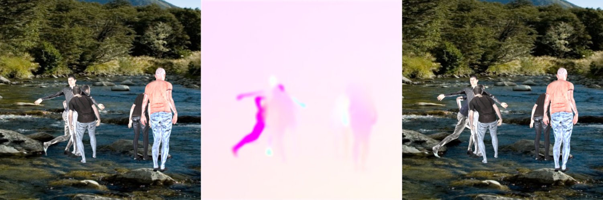
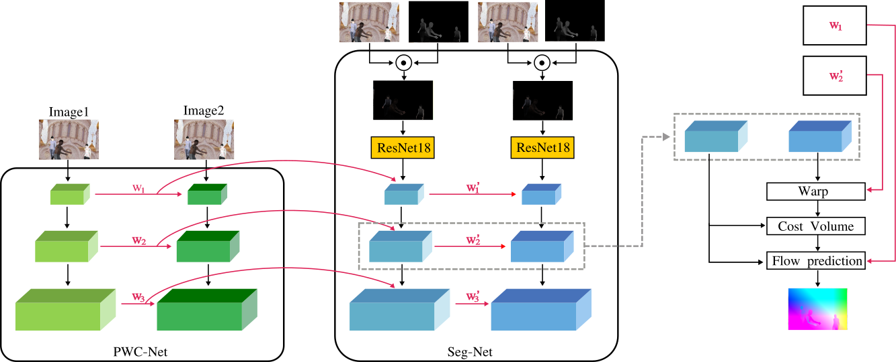

# Optical Flow Estimation[[PDF](https://github.com/municola/optical-flow-estimation/blob/master/Report.pdf)]

This is our project for the Machine Perception course at ETH Zürich  
It is based on the PWC-Net from Nvidia.

## Abstract
Human optical flow plays an important role in the analysis of human action. We present a deep learning based approach to predict the optical flow in multi-human scenes. Our method is based on PWC-Net, a general optical flow estimation network. We use the Multi-human optical flow dataset to fine-tune the before-mentioned model, and introducing an iterative refinement procedure and a cyclic loss to achieve a significant improvement in the flow computation. We furthermore introduce a novel architecture which runs in harmony with PWC-Net and makes additional use of pre-computed segmentation masks.

## Task
Predict the optical flow between two consecutive Images.
For each pixel we estimate its movement between the left and the right RGB image. The flow prediction is visualized with the middle image.

## Implementation details
**Arichtecture**: 
PWC-net + Iterative Refinement + Cycle consistency  
We base our architecture on the pretrained PWC-net. By iteratively apply the PWC-net on the residual flow we increase the accuracy in each iteration. Additionally we perform an inverse flow prediction to introduce a cycle consistency loss which further improves the quality of our flow estimatinon.   

**Performance**: We achieve a 67% End Point Error reduction in respect to the normal PWC-Net (NVIDIA)  
**Frameworks**: Pytorch  
**Programming Languge**: Python

